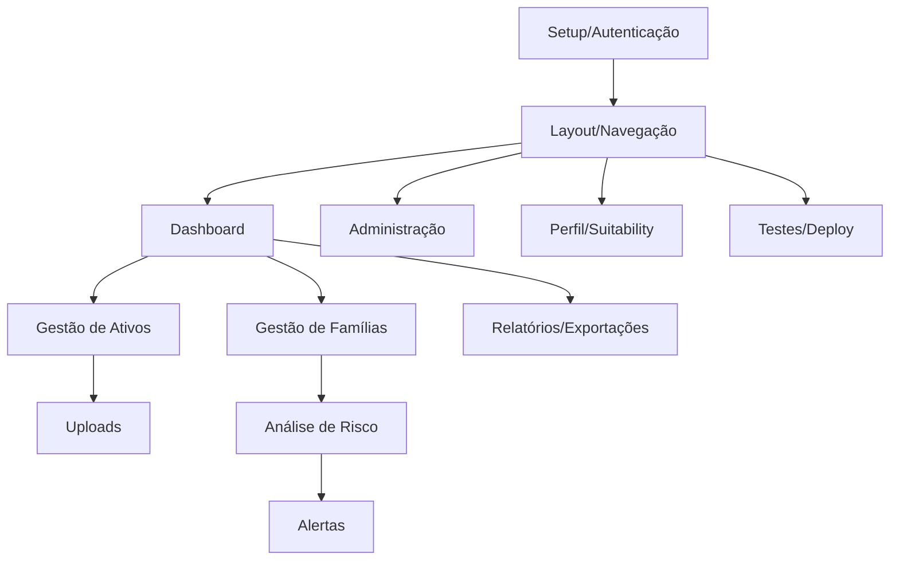

# 🗺️ Roadmap & Backlog — Family Office Digital

## Visão Geral

Este documento detalha o roadmap, milestones e backlog do projeto Family Office Digital. Cada tarefa está descrita de forma clara e objetiva para permitir que humanos ou IAs possam dar continuidade ao desenvolvimento sem ambiguidade.

---

## 🏁 Milestones

### 1. Setup Inicial
- **Status:** Concluído
- Estrutura base Flask (App Factory, Blueprints)
- Configuração SQLAlchemy, Alembic, ambiente, JWT, logging, testes iniciais

### 2. Gestão de Usuários e Perfis
- **Status:** Concluído (exceto suitability)
- Autenticação JWT, refresh token
- Modelos de usuários, famílias, multi-tenancy
- Permissões por escopo, decorators
- Cadastro de perfil suitability (**pendente**)

### 3. Cadastro e Upload de Ativos
- **Status:** Concluído (backend)
- Modelos para cada classe de ativo (RF, RV, Multimercados, etc.)
- Endpoints de cadastro, edição, listagem
- Parser para arquivos CSV/XLSX com validação automática
- Upload e OCR de PDFs (Tesseract)
- Auto-identificação e classificação de ativos

### 3.1. Sistema de Transações ✅ **NOVO**
- **Status:** Concluído (backend)
- Modelo de Transaction com relacionamento N:1 para Asset
- Cálculo dinâmico de valores baseado em transações de compra/venda
- Propriedades calculadas: current_quantity, current_value, average_cost
- Validações para evitar venda além da quantidade possuída
- Endpoints CRUD completos para transações
- Testes TDD implementados
- Schema de validação com Marshmallow
- Migration automática criada

### 4. Análise de Risco e Score
- **Status:** Concluído (backend)
- Implementar cálculo de risco individual por ativo
- Score consolidado da carteira
- API para dados por classe, moeda, indexador

### 5. Alertas Automatizados
- **Status:** Concluído (backend)
- Regras críticas (concentração, liquidez, vacância)
- Endpoint de listagem/histórico de alertas

### 6. Atualização de Cotações ✅ **NOVO**
- **Status:** Concluído
- Integração com Yahoo Finance, CoinGecko, Bacen
- Job APScheduler para atualizações diárias
- Serviço de cotações com histórico
- Modelo QuoteHistory para armazenar preços

### 7. Relatórios e Exportações ✅ **NOVO**
- **Status:** Concluído
- Geração de relatórios PDF (WeasyPrint)
- Relatórios de carteira, risco, transações e fiscal
- Templates HTML personalizáveis
- Exportação em PDF para todas as funcionalidades

### 8. Suitability e Recomendações ✅ **NOVO**
- **Status:** Concluído
- Cadastro e avaliação de perfil suitability
- Análise de compatibilidade entre perfil e carteira
- Sugestões de rebalanceamento e recomendações
- Modelo SuitabilityProfile com scores de risco
- Sistema de recomendações automáticas

### 9. Sistema de Agendamento ✅ **NOVO**
- **Status:** Concluído
- APScheduler para tarefas automáticas
- Atualização diária de cotações
- Verificação periódica de alertas
- Limpeza automática de dados antigos
- Backup automático de dados
- Logs de execução dos jobs

### 9. Testes Automatizados & Documentação
- **Status:** Concluído (backend)
- Cobertura Pytest
- Documentação Markdown e Swagger (Flask-RESTX)

### 10. Deploy & Integração Frontend ✅ **CONCLUÍDO**
- **Status:** Concluído
- Configuração Docker completa (backend, frontend, database)
- Docker Compose para desenvolvimento local
- Configuração Railway para deploy em produção
- Health checks e monitoramento
- Documentação Docker completa
- Deploy automatizado no Railway

### 11. Melhorias de UI/UX ✅ **CONCLUÍDO**
- **Status:** Concluído
- Integração do menu de navegação ao header
- Melhoria da hierarquia visual e usabilidade
- Ajustes de responsividade e acessibilidade
- Modal de transações com comportamento padrão (createPortal)
- Dashboard refatorado com novo retorno da API
- Gestão de sessão melhorada com interceptors do Axios

### 12. Gestão de Sessão e Autenticação ✅ **CONCLUÍDO**
- **Status:** Concluído
- Interceptors do Axios para refresh automático de tokens
- Redirecionamento automático para login quando token expira
- Melhor tratamento de erros 401
- Logout automático em caso de refresh token inválido
- Limpeza automática do localStorage

### 13. Dashboard Avançado e Gráficos ✅ **NOVO**
- **Status:** Concluído
- Componentes de gráficos interativos (PieChart, BarChart)
- Métricas de performance com indicadores de tendência
- Centro de notificações em tempo real
- Header modernizado com busca e menu responsivo
- Visualizações avançadas de distribuição de ativos
- Indicadores de risco com cores e ícones intuitivos

---

## 🖥️ Roadmap Frontend — Dashboard Family Office

### Visão Geral
O frontend será um dashboard web responsivo, moderno, com navegação lateral, cards, gráficos e formulários dinâmicos para gestão patrimonial multi-família. Baseado no layout.png e requisitos, o sistema terá as seguintes áreas principais:

- Login/Autenticação
- Dashboard consolidado
- Gestão de Famílias
- Gestão de Ativos
- Upload de Arquivos
- Análise de Risco
- Alertas
- Administração (usuários, famílias)
- Perfil/Suitability
- Relatórios e Exportações

### Roadmap de Atividades Frontend

1. **Setup Inicial**
   - Escolha do framework (React + TypeScript recomendado)
   - Configuração Vite, ESLint, Prettier
   - Estrutura de pastas e componentes base

2. **Sistema de Autenticação**
   - Tela de login responsiva
   - Context API para gerenciamento de estado
   - Proteção de rotas
   - Persistência de tokens

3. **Layout e Navegação** ✅ **MELHORADO**
   - Header integrado com menu de navegação
   - Seletor de família no header
   - Informações de usuário e logout
   - Navegação por tabs integrada ao header
   - Design responsivo e moderno

4. **Dashboard Principal** ✅ **IMPLEMENTADO**
   - Cards com métricas principais
   - Gráficos de distribuição de ativos
   - Lista de alertas recentes
   - Score de risco consolidado
   - Transações recentes
   - Gráficos interativos (pizza e barras)
   - Métricas de performance com tendências
   - Centro de notificações em tempo real

5. **Gestão de Ativos**
   - Lista de ativos com filtros
   - Formulário de cadastro/edição
   - Upload de arquivos (CSV/XLSX/PDF)
   - Integração com transações

6. **Sistema de Transações**
   - Lista de transações por ativo
   - Formulário de nova transação
   - Resumo financeiro (P&L)
   - Navegação bidirecional com ativos

7. **Análise de Risco**
   - Score de risco consolidado
   - Análise individual por ativo
   - Recálculo manual de risco
   - Visualização por família

8. **Upload e Importação**
   - Interface de upload de arquivos
   - Templates para download
   - Histórico de uploads
   - Feedback visual de progresso

9. **Perfil e Configurações**
   - Informações do usuário
   - Alteração de senha
   - Lista de permissões
   - Dados de suitability

10. **Painel Administrativo**
    - Gestão de usuários
    - Gestão de famílias
    - Configurações do sistema
    - Logs e auditoria

11. **Relatórios e Exportações**
    - Geração/download de relatórios PDF, exportação CSV/PDF

12. **Testes e Qualidade**
    - Testes unitários/integrados, lint, boas práticas

13. **Deploy e Integração**
    - Configuração de ambiente, deploy (Vercel/Netlify), integração final

#### Fluxo Visual

---

## 📋 Backlog Detalhado

### [A] Cadastro e Upload de Ativos
- **A1. Modelos de Ativos:**
  - Criar modelos ORM para cada classe de ativo (RF, RV, Multimercados, Ativos Reais, Estratégicos, Internacionais, Alternativos, Proteção).
  - Cada modelo deve conter campos obrigatórios conforme requisitos.
- **A2. Endpoints CRUD:**
  - Implementar endpoints REST para cadastro, edição, listagem e deleção de ativos.
  - Garantir autenticação e escopo de família.
- **A3. Upload e Parser de Arquivos:**
  - Implementar upload de arquivos .csv e .xlsx.
  - Criar parser que valida e cadastra ativos automaticamente.
- **A4. OCR de PDFs:**
  - Implementar upload de PDFs e extração de dados via Tesseract/pdfminer.
  - Mapear dados extraídos para cadastro de ativos.
- **A5. Autoidentificação de Classe:**
  - Desenvolver lógica para identificar e classificar automaticamente o tipo de ativo a partir dos dados de entrada.

### [B] Análise de Risco e Score
- **B1. Risco Individual:**
  - Implementar cálculo de risco por ativo (mercado, liquidez, concentração, crédito, cambial, jurídico/fiscal, governança).
- **B2. Score Consolidado:**
  - Calcular score global da carteira com pesos definidos.
- **B3. API de Risco:**
  - Expor endpoints para consulta de risco individual e consolidado.

### [C] Alertas Automatizados
- **C1. Regras de Alerta:**
  - Implementar regras: concentração (>30%), liquidez (>50% ilíquidos), score global (>70), downgrade/inadimplência/vacância, mudanças fiscais.
- **C2. Endpoints de Alertas:**
  - Criar endpoints para listar e consultar histórico de alertas.

### [D] Atualização de Cotações ✅ **IMPLEMENTADO**
- **D1. Integração APIs Externas:**
  - ✅ Integrar Yahoo Finance, CoinGecko, Bacen para atualização de preços e cotações.
- **D2. Job de Atualização:**
  - ✅ Agendar job diário com APScheduler para atualizar valores de mercado e histórico.

### [E] Relatórios e Exportações ✅ **IMPLEMENTADO**
- **E1. Relatórios PDF:**
  - ✅ Gerar relatórios PDF com composição da carteira, análise de risco, sugestões e simulações.
- **E2. Exportação Fiscal:**
  - ✅ Implementar exportação de dados fiscais em PDF.

### [F] Suitability e Recomendações ✅ **IMPLEMENTADO**
- **F1. Cadastro de Perfil:**
  - ✅ Permitir cadastro e edição do perfil suitability do usuário (conservador, moderado, arrojado).
- **F2. Análise de Compatibilidade:**
  - ✅ Avaliar compatibilidade entre perfil e alocação da carteira.
- **F3. Recomendações:**
  - ✅ Sugerir rebalanceamento e substituição de ativos conforme perfil e risco.

### [G] Testes e Documentação
- **G1. Testes Automatizados:**
  - Cobrir endpoints e lógica de negócio com Pytest.
- **G2. Documentação API:**
  - Garantir documentação Swagger atualizada e clara.

### [H] Deploy & Integração Frontend
- **H1. Deploy:**
  - Automatizar deploy em Render.com ou VPS (Docker/Gunicorn/Nginx).
- **H2. Integração Frontend:**
  - Testar e validar integração com frontend (Swagger/Postman).

### [I] Melhorias de UI/UX ✅ **IMPLEMENTADO**
- **I1. Integração Menu-Header:**
  - ✅ Mover menu de navegação para dentro do header
  - ✅ Melhorar hierarquia visual e usabilidade
  - ✅ Ajustar estilos para consistência visual
- **I2. Responsividade:**
  - ✅ Implementar design responsivo para mobile
  - ✅ Ajustar breakpoints e layouts
- **I3. Acessibilidade:**
  - ✅ Adicionar atributos ARIA
  - ✅ Melhorar navegação por teclado
  - ✅ Implementar contraste adequado
- **I4. Performance:**
  - ✅ Otimizar carregamento de componentes
  - ✅ Implementar lazy loading
  - ✅ Melhorar cache de dados

### [J] Dashboard Avançado ✅ **IMPLEMENTADO**
- **J1. Gráficos Interativos:**
  - ✅ Componente PieChart para distribuição de ativos
  - ✅ Componente BarChart para top ativos
  - ✅ Tooltips e interatividade
- **J2. Métricas de Performance:**
  - ✅ Indicadores de tendência (crescimento/queda)
  - ✅ Comparação com períodos anteriores
  - ✅ Formatação inteligente de valores
- **J3. Centro de Notificações:**
  - ✅ Sistema de notificações em tempo real
  - ✅ Filtros por tipo e status
  - ✅ Ações rápidas e gestão de alertas
- **J4. Header Modernizado:**
  - ✅ Busca global integrada
  - ✅ Menu responsivo para mobile
  - ✅ Seletor de família centralizado
  - ✅ Menu de usuário com opções avançadas

### [K] Melhorias na Entidade Asset ✅ **IMPLEMENTADO**
- **K1. Otimização de Modelo:**
  - ✅ Remoção do campo `value` deprecated
  - ✅ Implementação de cache para cálculos pesados
  - ✅ Propriedades específicas por tipo de ativo
- **K2. Validação Robusta:**
  - ✅ Validação de tickers por bolsa de valores
  - ✅ Normalização automática de símbolos
  - ✅ Validação de campos obrigatórios por classe
  - ✅ Suporte a criptomoedas e moedas estrangeiras
- **K3. Cálculos Precisos:**
  - ✅ Cálculo FIFO de custo médio
  - ✅ Ganhos/perdas realizados por lote
  - ✅ Métricas de risco por ativo
  - ✅ Integração com histórico de cotações
- **K4. Interface Melhorada:**
  - ✅ Formulários dinâmicos por tipo de ativo
  - ✅ Sugestões de tickers e campos
  - ✅ Validação em tempo real
  - ✅ Suporte a múltiplas bolsas

---

## 🔄 Como Usar este Backlog
- Cada tarefa está descrita de forma autossuficiente.
- Para iniciar uma tarefa, busque pelo código da tarefa (ex: A3, B2) e siga a descrição.
- Atualize o status das tarefas conforme forem concluídas.
- Adicione detalhes ou sub-tarefas conforme necessário para granularidade. 